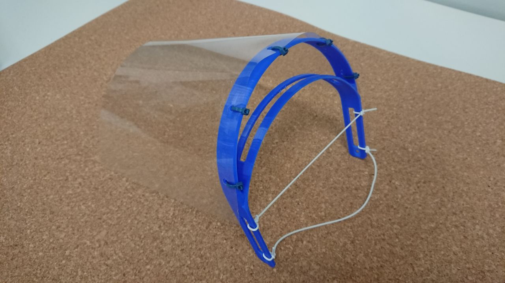
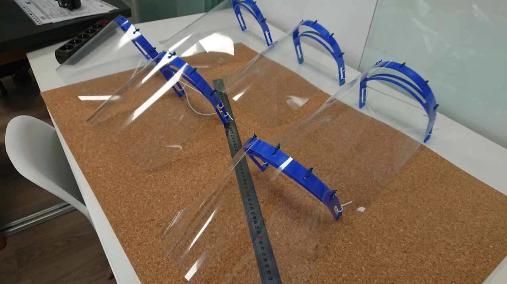
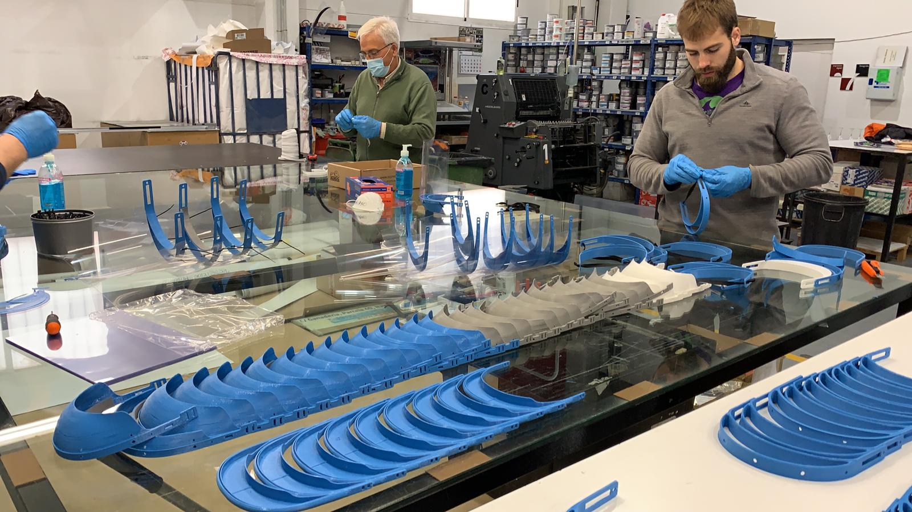
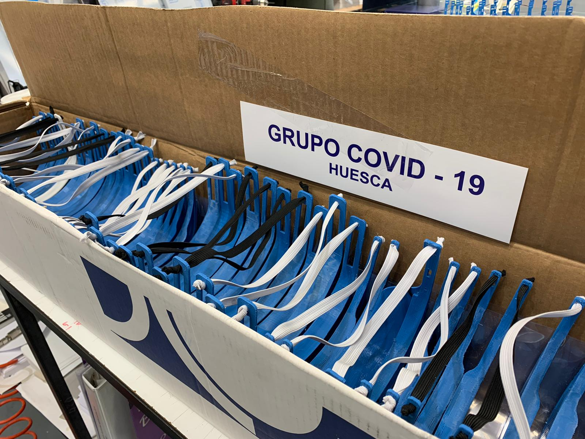
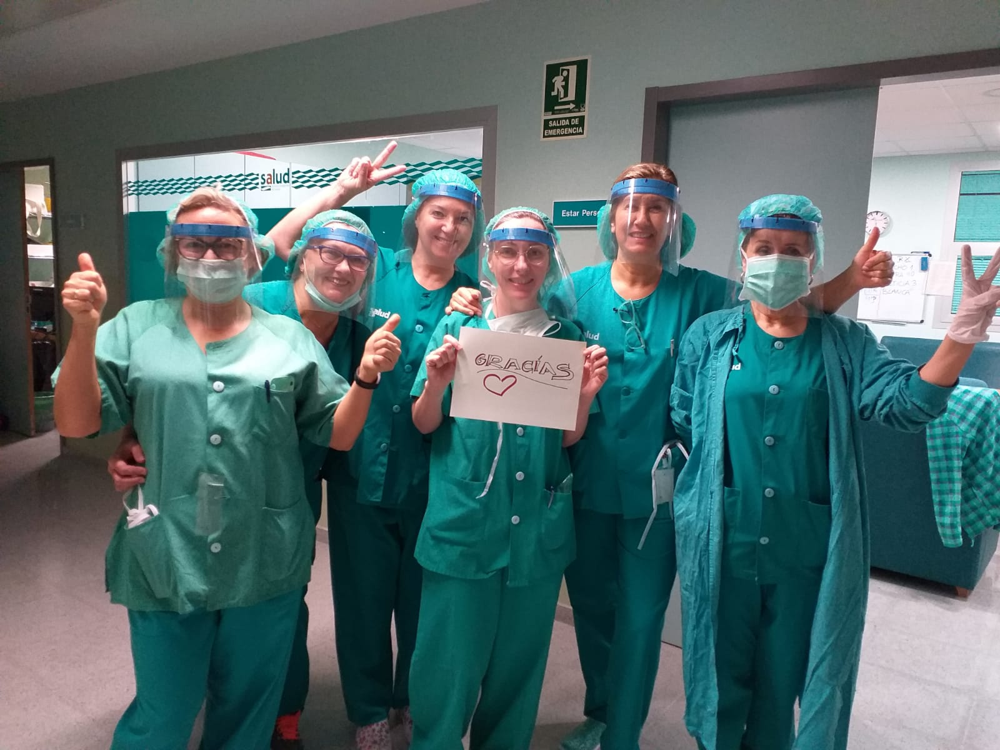
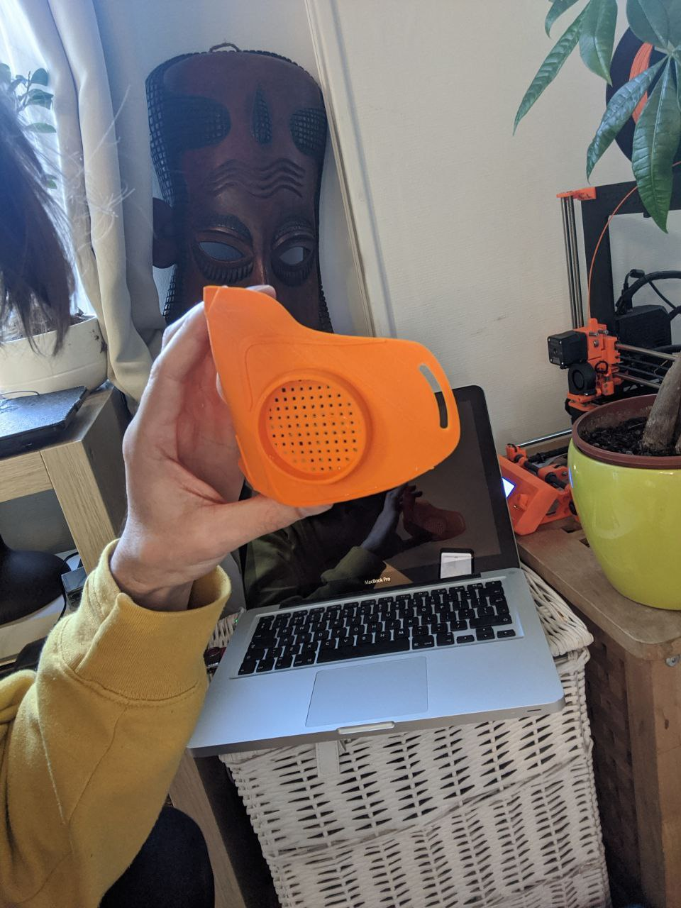
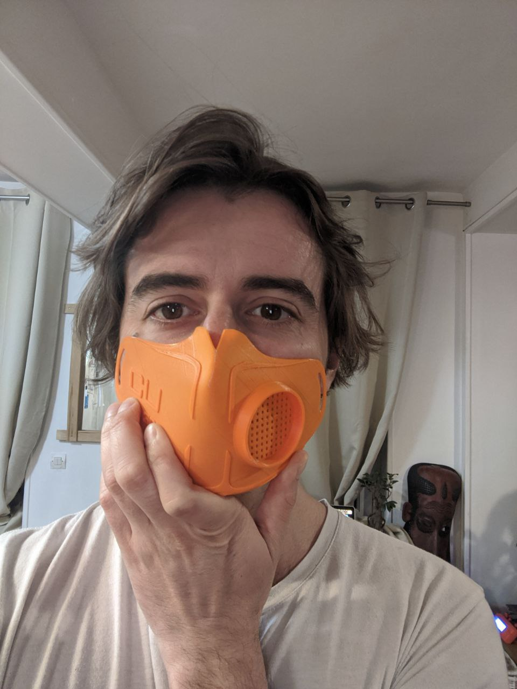
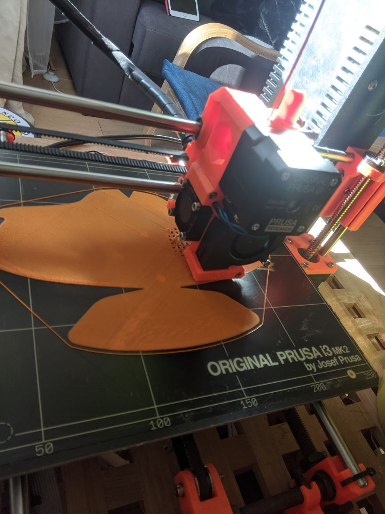
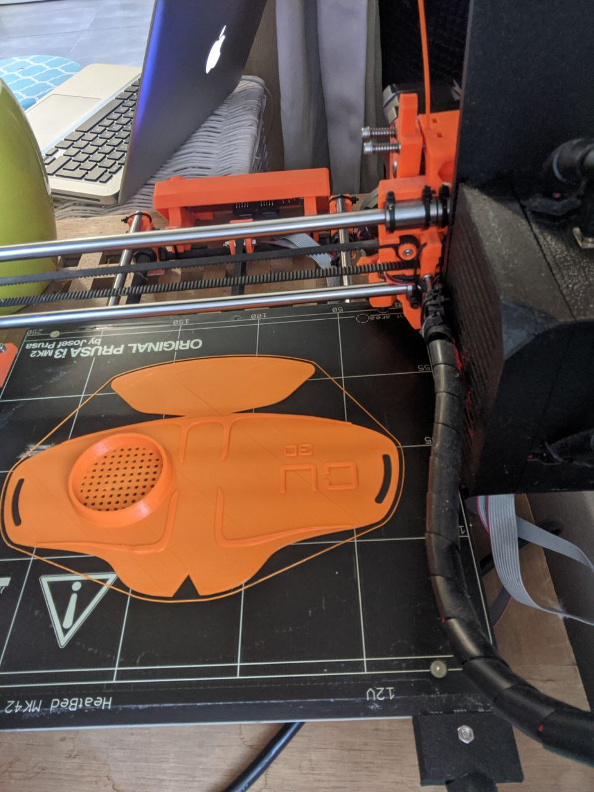

# covid-19-open-source-masks-list
List of Covid-19 Open Source Mask initiatives for emergency purposes that have been tested by the community

**Prusa Protective Face Shield - RC3, 3D printed face shields for medics and professionals by Prusa**

Open-source face shields anyone with a 3D printer can help producing. Join the community-driven effort to help professionals in your area.

Updates: 3/28, 10.00 Protection shield RC3 has been approved for use by michigan medecine procurement.

- website: https://www.prusa3d.com/covid19/
- Frequent questions: https://help.prusa3d.com/en/article/3d-printed-protective-face-shields-faqs_125479
- Media: https://www.prusa3d.cz/wp-content/uploads/2020/03/fb_post.jpg
- Feedback: ✅ tested by @bneiluj. Fixations are not so great
- Health precautions according to the French authorities (French only): http://www.fablab.fr/coronavirus/prototypage-et-projets/article/2-visieres-de-protection-coronavirus
- Files: Version RC3: https://www.prusaprinters.org/prints/27267
- Quality: 10/10
- Printing time: ~2h

  &nbsp;
  &nbsp;

  

  &nbsp;
  &nbsp;
  &nbsp;

**3d printable mask for covid-19**

Due to a shortage of masks for healthcare professionals across the country, we have developed and designed a 3D printed mask. This has been a collaborative effort with several individuals and local entities. We are encouraging all hobbyist, dentists, schools, universities and anyone with 3D printers to start making these masks and delivering them to your local hospitals!

Masks require a filter which can be made cutting up a single mask into 6 pieces or by ordering custom filter patches (which exceed industry standards) from flowmarkhightech.com. His business has the capacity to produce as many as are needed.

- Website: https://longliveyoursmile.com/3d-printable-mask-for-covid-19/
- Files: https://longliveyoursmile.com/download/1405/
- Twitter: https://twitter.com/ZauggDentistry
- Media: https://longliveyoursmile.com/3d-printable-mask-for-covid-19/
- Feedback: ✅ Tested by @bneiluj[https://github.com/bneiluj] @pepae[https://github.com/pepae] It's good mask but PLA is not so good to stop air between skin and mask borders. It's recommended to add a tissue
- Quality: 6/10

  

https://www.prusa3d.com/covid19/

**3d printable protective mask**

Mask being printed and distributed in the province of Huesca in Spain.  
As of 27th March 2020, they are a group of 68 people helping produce them and have distributed 1400 units.

- Materials: PLA (Donated by Plásticos Escanero), acetate, plastic bridle, flexible transparent plastic (PVC) or A4 tranparent book covers  
- Printer settings: Height cover 0.2 speed 80mm/s, unfilled, with supports  

  &nbsp;
  &nbsp;

  

  &nbsp;
  &nbsp;
  &nbsp;

**Copper3D n95 masks**

NanoHack was inspired by a great global pandemic. The most radical innovations are born from crises, which is why NanoHack is a unique design.

- Website:https://cults3d.com/en/3d-model/tool/n95-masks-against-coronavirus-covid19-hackthepandemic
- Files: https://copper3d.com/hackthepandemic/
- Twitter: https://twitter.com/Copper3D_Global
- Media: https://www.instagram.com/copper3d_global/
- Feedback: 🔺 Tested by @bneiluj[https://github.com/bneiluj] @pepae[https://github.com/pepae]. It doesn't fit the visage and air goes through the borders. It's very long to print.
- Quality: 1/10
- Recommendation: Not recommended for usage.

  &nbsp;
  &nbsp;

  

  &nbsp;
  &nbsp;

**3D printed visor, completed with a transparent sheet of paper**

Open-source face shields you can print on any 3D printer. On an Ender 3 I was able to print one in less than an hour.

- website: https://3dverkstan.se/protective-visor/
- Optimising your print: https://3dverkstan.se/protective-visor/protective-visor-print-guide/
- Feedback: Print great, has started shipping to various people in France
- Files: https://www.youmagine.com/designs/protective-visor-by-3dverkstan

  &nbsp;
  &nbsp;

  

**Laser cut visor, completed with a transparent sheet of paper**

Open-source face shields you can laser cut with a laser cutter. Throughput is maximised and highly versatile use.
The design was tested and validated by hospital crew in Lyon, France

- website: https://grabcad.com/library/covisiere-youfactory-v1-1
- Feedback: Ships ultra fast, fits great, no need for a rubber band, plastic sheet is held tight to headset. Great for mass production.
- Files: https://grabcad.com/library/covisiere-youfactory-v1-1

  &nbsp;
  &nbsp;

  

# Contributors

This project exists thanks to all the people who contribute. https://github.com/bneiluj/covid-19-open-source-ventilators/graphs/contributors 🙏 

[Telegram Group](https://t.me/OpenSourceCovidVentilators)

# Backers

Thank you to all our backers! 🙏 [Become a backer](https://gitcoin.co/grants/578/open-source-covid-ventilator-oscv?tab=contributors)

  &nbsp;

  

 This work is licensed under a <a rel="license" href="http://creativecommons.org/licenses/by/4.0/">Creative Commons Attribution 4.0 International License</a>.
